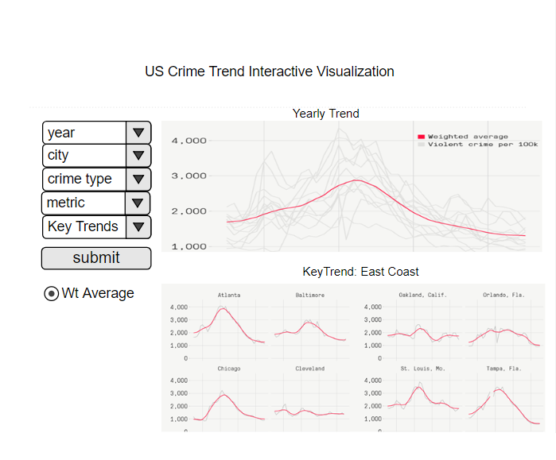

# US_Crime_Trend
Yenan Zhang ([YenanZ](https://github.com/YenanZ)) and Krish Andivel ([Gopsathvik](https://github.com/Gopsathvik)) 

## Overview 
Law and order has always been a huge topic in U.S. politics, with presidents declaring war on crimes and painting the society as increasingly unsafe and violent. However, is it based on facts or just plain fear-mongering? What are the cities whose crime rate increased or decreased drastically? This visualization app allows you to see the trend of various kind of violent crimes( rape, homicide, robbery, assualt) across different U.S. cities. 

## Description of the data

Our team will visualize the trends of crimes (violent_per_100k,homs_per_100k,rape_per_100k,rob_per_100k,agg_ass_per_100k) in the US cities(department_name) occured from 1975 till 2015. We will provide a trend of various crime rate of cities for the top 10 most populated cities(total_pop) using Shiny app. An interactive trend involving a type of crime (violent_per_100k,homs_per_100k,rape_per_100k,rob_per_100k,agg_ass_per_100k) facetted across various cities over a time period is also part of the proposal. The columns of the data:  

Variable   | Description                                                                                                                                                                                                                                                                                                   |
| ---------- | ------------------------------------------------------------------------------------------------------------------------------------------------------------------------------------------------------------------------------------------------------------------------------------------------------------- |
| department_name    | City from where the data was reported|
| total_pop     | Population of the city |
| homs_sum    | Number of  reported homicides|
| rape_sum        | Number of reported rapes|
| rob_sum     | Number of reported robbery |
| agg_ass_sum         | Number of aggravated assault reports|
| violent_crime | Total of all reported crimes|
| violent_per_100k| Number of violent crimes per population of 100,000  |
| homs_per_100k     | Number of homicides crimes per population of 100,000    |
| rape_per_100k        | Number of rapes crimes per population of 100,000   |
| rob_per_100k| Number of robbery crimes per population of 100,000|
| agg_ass_per_100k| Number of aggravated assault crimes per population of 100,000|

## Usage scenario

John is a political scientist studying the trend of various crimes in major U.S. cities in order to provide policy advice to law makers. He first can [select] a particular crime of interest, for example rape, then he can [visualize] the average rate of that crime of all U.S. cities in a given time span. If he wish to see the trend of a particular city, he can [select] that city and see its crime rate for the type of crime he selected. Furthermore, he can [compare] the crime rate trend of that city with the national average or with another city. Based on this comparasion, he can identify the cities whose crime rate trends diverage drastically with the national trend and find association between municipal/state policy and crime rate. 

## App Sketch

