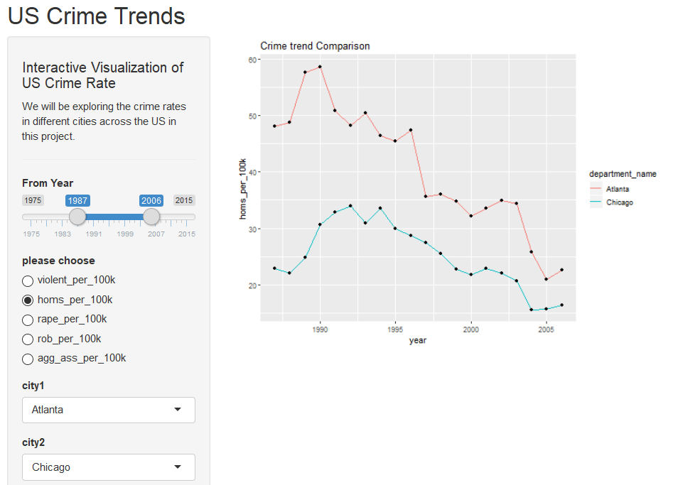
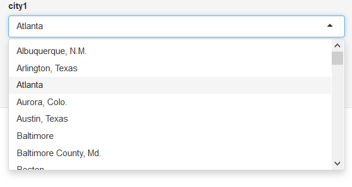
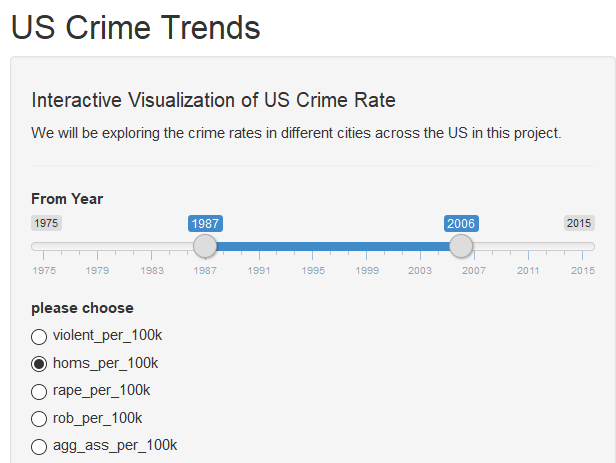
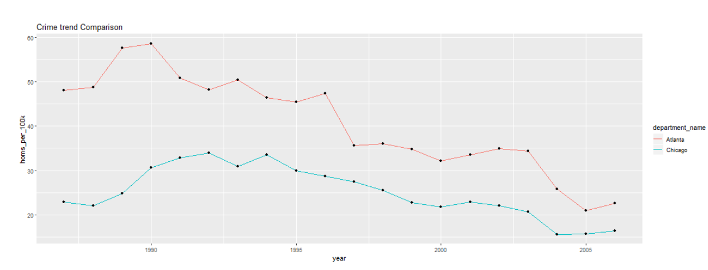

# Milestone 3 - Writeup

## Feedback links

https://github.com/UBC-MDS/us-police-shootings-analysis/issues/9

https://github.com/UBC-MDS/CrimeVisualizer/issues/16

## Comments on the feedback:

The peer feedback gave an insight into different perspective for the same problem that we were tryingto solve. They helped us incorporate additional design features.
These design features not only enhanced the visualizations but also provided more information for the problem we undertook to solve.
We also had the opportunity to look into the shiny apps created by our peers thereby learning new way doing shiny and additionally got to
know some more functionalities that cna developed using shiny app. The feedback session was win all for both teams abd it enhanced the way we see the solutions for the same problem.

## Implemented suggestion from peer Review:

- Included more all the crime types
- Modified the trend graph deisgn
- Added labels appropriately
- Inlcuded two city comparisons for a particular crime type

## Learning Opportunities:
 - Implementing a heat map was done locally but implementation needs debugging
 - Ranking cities based on a metric is also something we are targeting

1. Year (Slider)
2. city (Drop Down)
3. Crime Type (please choose) (Radio button)

##### 1. Year Slider

A range of year can be selected from 1975 to 2015.

##### 2. city

The type of crime for a selected city and year range can be chose here.

#### Plot

This plot shows the violent crime trend for the city of Atlanta from the 1983 - 2001 for the crime type of violent crimes per 100,000 people.

