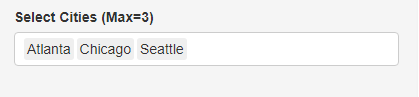
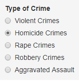
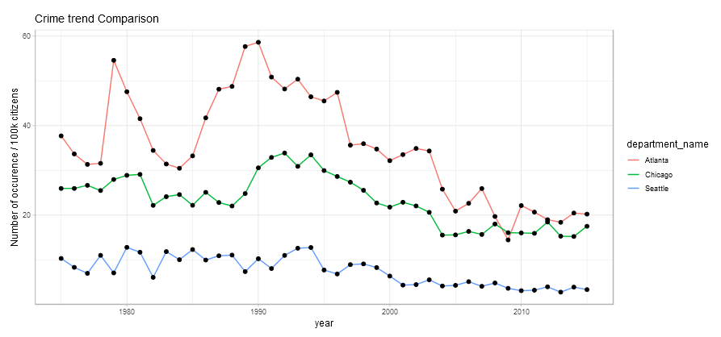

# Milestone 4 - Writeup

## Feature Options

### We considered the following features:
 1. Include ranking of the states
 2. Allow multiple states in a single plot

### Option 1: 
This option involved taking the weighted average based on the population and factoring with crime type for each city.
It required a data wrangling that involved adding new columns and changing the structure of code. We did a pilot that resulted
in the loss of original features. We debugged within a time limit of 45 mins and did a hard stop.

### Option 2:

This option involved modification in the current code structure like including argments values. We successfully tested the pilot
and were able to improve from the milestone 3 version.

### Additonal items:

The radio button labels were given a human readable labels and the y-label in the plot was also given a general name.
We were able to test the code and run the app successfully.

## App Re-engineering:

First of all build a robust vision and use case for the application.
We would get a list of candidate fetaures to be represented in shiny app. Then list down the metrics, data transformations needed for each features.
All the features will be ranked based on difficulty and the closeness to the overall objective.
We would decide which features to be taken up based on the time available and proceed further.

## Challenges

- Shiny App is very flexible
- We had difficulty figuring out various functions in shiny app and the operations within the widgets

1. Year (Slider)
2. Type of Crime (Radio Button)
3. Select Cities (Max=3)

##### 1. Year - Slider

A range of year can be selected from 1975 to 2015.

##### 2. Select Cities - Dropdown

User can select the city for which crime trend has to be viewed.

##### 3. Type of Crime - Radio button

The type of crime for a selected cities.

#### Plot

This plot shows the Homicides per 100K citizens trend for the cities of Atlanta,Chicago ans Seattle from the 1975 - 2015.
